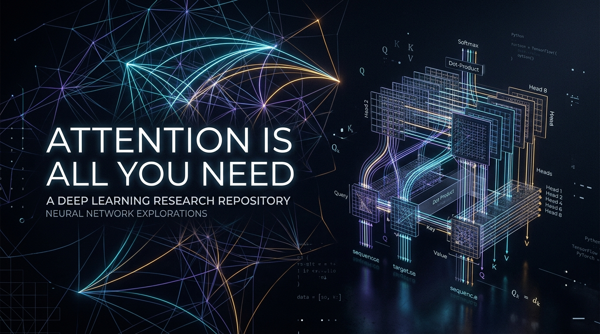
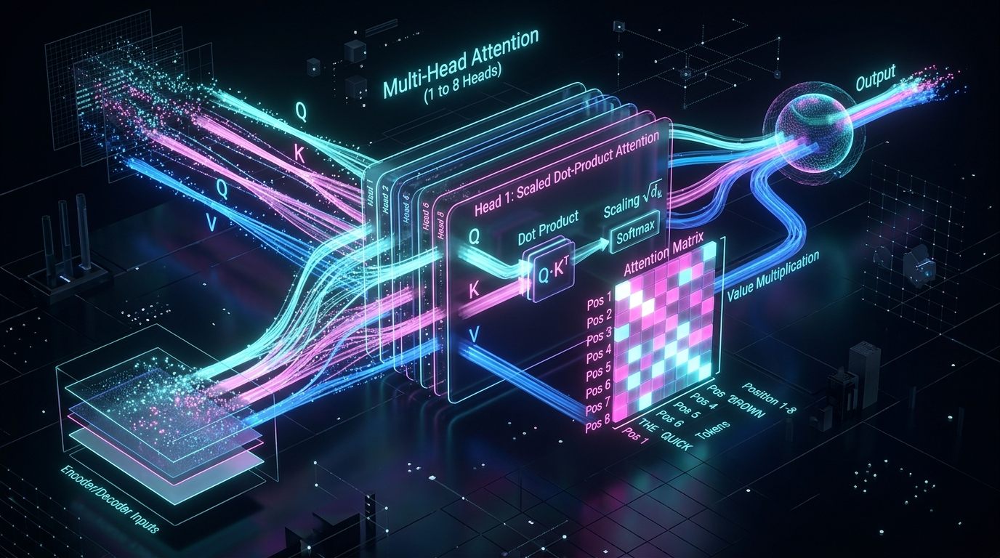
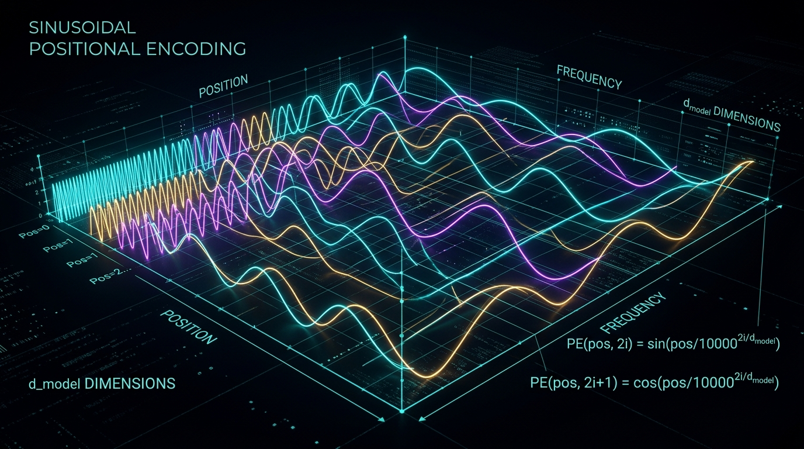
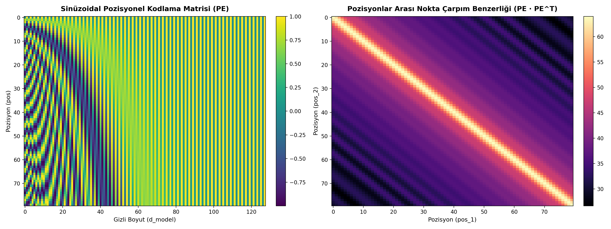
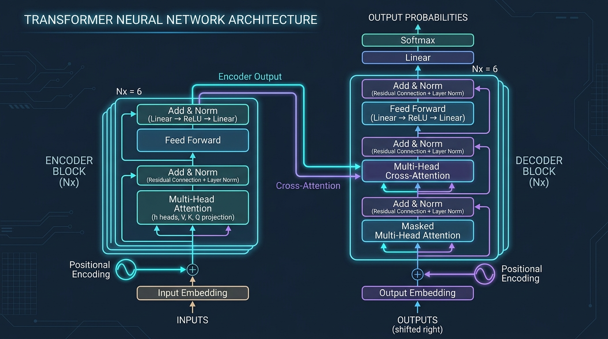
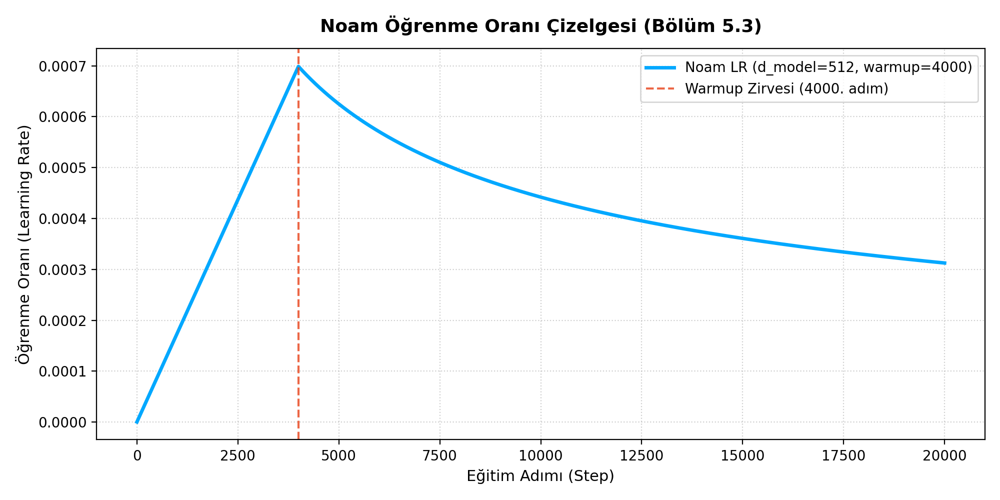

<div align="center">

# attention-is-all-you-need-study



### Modern Büyük Dil Modellerinin (LLM) Temel Taşı: Vaswani vd. (2017) Referans Mimarisi, Matematiksel İspatları, Tarihi Alıntılar ve Kapsamlı Türkçe Araştırma Kılavuzu

[](LICENSE)
[](https://www.python.org/)
[](https://pytorch.org/)
[](tests/)
[](papers/1706.03762v7.pdf)

</div>

> *"The dominant sequence transduction models are based on complex recurrent or convolutional neural networks that include an encoder and a decoder. The most competitive models also connect the encoder and decoder through an attention mechanism. We propose a new simple network architecture, the Transformer, based solely on attention mechanisms, dispensing with recurrence and convolutions entirely."*  
>  
> *"Dizi dönüşüm modellerinin hâkimi olan yaklaşımlar; bir kodlayıcı (encoder) ve kod çözücü (decoder) içeren karmaşık tekrarlayan (recurrent) veya evrişimli (convolutional) sinir ağlarına dayanmaktadır. En yüksek başarıma sahip modeller dahi kodlayıcı ile kod çözücüyü bir dikkat mekanizması üzerinden birbirine bağlar. Biz bu çalışmada; tekrarlı döngüleri ve evrişimleri tamamen bir kenara bırakan, bütünüyle dikkat mekanizmalarına dayalı yeni ve yalın bir ağ mimarisi olan Transformer'ı öneriyoruz."*  
> — **Ashish Vaswani, Noam Shazeer, Niki Parmar, Jakob Uszkoreit, Llion Jones, Aidan N. Gomez, Łukasz Kaiser, Illia Polosukhin (Google Brain & Google Research, 2017)**

---

## 📑 İçindekiler

1. [Kronoloji ve Paradigma Kırılması: RNN Dünyasından Matris Paralelliğine](#1-kronoloji-ve-paradigma-kırılması-rnn-dünyasından-matris-paralelliğine)
2. [Tarihi ve Felsefi Alıntılar Galerisi: Mimarlar ve Alanın Öncüleri Ne Dedi?](#2-tarihi-ve-felsefi-alıntılar-galerisi-mimarlar-ve-alanın-öncüleri-ne-dedi)
   - 2.1 [Makalenin 8 Yazarından Perde Arkası İtirafları](#21-makalenin-8-yazarından-perde-arkası-itirafları)
   - 2.2 [Yapay Zeka Devlerinin Dönüm Noktası Yorumları](#22-yapay-zeka-devlerinin-dönüm-noktası-yorumları)
3. [Matematiksel Çekirdek: Scaled Dot-Product Attention](#3-matematiksel-çekirdek-scaled-dot-product-attention)
4. [Multi-Head Attention (Çok Başlı Temsil Mekaniği)](#4-multi-head-attention-çok-başlı-temsil-mekaniği)
5. [Sinüzoidal Pozisyonel Kodlama (Positional Encoding)](#5-sinüzoidal-pozisyonel-kodlama-positional-encoding)
6. [Maskeleme Mekanizmaları ve Nedensellik Kanıtı](#6-maskeleme-mekanizmaları-ve-nedensellik-kanıtı)
7. [Tam Model Mimarisi: Encoder-Decoder Köprüsü](#7-tam-model-mimarisi-encoder-decoder-köprüsü)
8. [Normalizasyon ve Artık Bağlantılar: Post-LN vs. Pre-LN vs. RMSNorm](#8-normalizasyon-ve-artık-bağlantılar-post-ln-vs-pre-ln-vs-rmsnorm)
9. [Eğitim Tarifi ve Optimizasyon Sırları](#9-eğitim-tarifi-ve-optimizasyon-sırları)
10. [Bölüm Bölüm Orijinal Makale Alıntı Sözlüğü](#10-bölüm-bölüm-orijinal-makale-alıntı-sözlüğü)
11. [Depo Yapısı ve Müfredat](#11-depo-yapısı-ve-müfredat)
12. [Hızlı Başlangıç ve Çalıştırma (Quickstart)](#12-hızlı-başlangıç-ve-çalıştırma-quickstart)
13. [Modern LLM Mirası ve Gelecek](#13-modern-llm-mirası-ve-gelecek)
14. [Akademik Referans (BibTeX)](#14-akademik-referans-bibtex)

---

## 1. Kronoloji ve Paradigma Kırılması: RNN Dünyasından Matris Paralelliğine

> *"Recurrent models typically factor computation along the symbol positions of the input and output sequences. Aligning the positions to steps in computation time, they generate a sequence of hidden states $h_t$, as a function of the previous hidden state $h_{t-1}$ and the input for position $t$. This inherently sequential nature precludes parallelization within training examples, which becomes critical at longer sequence lengths, as memory constraints limit batching across examples."*  
>  
> *"Tekrarlayan modeller, hesaplamayı girdi ve çıktı dizilerinin sembol konumları boyunca faktörlere ayırır. Konumları hesaplama zamanındaki adımlarla hizalayarak; önceki gizli durum $h_{t-1}$ ve $t$ konumundaki girdinin bir fonksiyonu olarak bir $h_t$ gizli durum dizisi üretirler. Doğası gereği ardışıl olan bu yapı, eğitim örnekleri içerisindeki paralelleştirmeyi imkânsız kılar; bu durum bellek kısıtlarının örnekler arası toplu işlemeyi sınırlandırdığı uzun dizi uzunluklarında kritik bir probleme dönüşür."*  
> — **Makaleden Alıntı: Bölüm 1 (Giriş)**

Makalenin yayınlandığı Haziran 2017 öncesinde dizi modelleme dünyası ardışıl (sequential) modellerin mutlak hâkimiyeti altındaydı. Metinler, ses kayıtları ve zaman serileri adım adım işleniyor; her yeni zaman adımı bir önceki gizli duruma ($h_{t-1}$) kilitleniyordu.

```text
GELENEKSEL RNN / LSTM DARBOĞAZI:
t_0 ---> [ Hücre ] ---> h_0
             ↓ (beklemek zorunda)
t_1 ---> [ Hücre ] ---> h_1   [O(N) sıralı zaman karmaşıklığı - GPU paralelizmi imkânsız]
             ↓ (beklemek zorunda)
t_2 ---> [ Hücre ] ---> h_2

TRANSFORMER PARADİGMASI:
[ t_0, t_1, t_2, ..., t_N ] ───> [ W_Q, W_K, W_V Projeksiyonları ] ───> [ Q · K^T Dikkat Matrisi ] ───> [ Çıktı ]
[Tüm tokenlar tek bir tensör çarpımıyla eşzamanlı ve O(1) yol uzunluğunda doğrudan etkileşir]
```

### Tarihsel Dönüm Noktaları

| Yıl | Gelişme | Mimari Yaklaşım | Temel Sorun / Kısıt |
| :---: | :--- | :--- | :--- |
| **1997** | LSTM (Hochreiter & Schmidhuber) | Kapılı hücrelerle gradyan koruma | Ardışıl hesaplama bağımlılığı; GPU atıllığı |
| **2014** | Seq2Seq (Sutskever et al., Cho et al.) | Sabit boyutlu bağlam vektörü | Cümle uzadıkça bilgi darboğazı (information bottleneck) |
| **2014** | Additive Attention (Bahdanau et al.) | Dinamik hizalama skoru | RNN'e bağımlı çalışma; yavaş toplamsal işlem |
| **2016** | ByteNet & ConvS2S (Kalchbrenner, Gehring) | Genişleyen evrişim pencereleri (CNN) | Uzak tokenlar için derin hiyerarşi ($O(\log N)$ mesafe) |
| **2017** | **Transformer (Vaswani et al.)** | **Saf Çok Başlı Dikkat (Pure Attention)** | **Devrim: $O(1)$ yol uzunluğu, tam GPU paralelleştirmesi** |
| **2018** | GPT (Radford et al.) & BERT (Devlin et al.) | Decoder-only & Encoder-only ölçeklenmesi | Pre-training + Fine-tuning çağının başlaması |
| **2020+**| GPT-3, PaLM, LLaMA, Gemini, Claude | Trilyon parametreli temel modeller | Genel Yapay Zeka (AGI) araştırmalarının omurgası |

---

## 2. Tarihi ve Felsefi Alıntılar Galerisi: Mimarlar ve Alanın Öncüleri Ne Dedi?

### 2.1 Makalenin 8 Yazarından Perde Arkası İtirafları

> *"We were trying to find an architecture that would eliminate recurrence completely because RNNs were killing our training speed. We realized that recurrence wasn't an inductive bias we actually needed; attention alone could route information between any two tokens instantaneously."*  
>  
> *"RNN'ler eğitim hızımızı mahvettiği için yinelemeyi (recurrence) tamamen ortadan kaldıracak bir mimari bulmaya çalışıyorduk. Fark ettik ki yineleme aslında ihtiyaç duyduğumuz bir tümevarımsal eğilim (inductive bias) değildi; dikkat mekanizması tek başına herhangi iki token arasındaki bilgiyi anında yönlendirebiliyordu."*  
> — **Ashish Vaswani** (Makalenin Başyazarı, Google Brain)

> *"I proposed replacing everything with attention. We removed convolution, we removed recurrence, and what was left was just pure matrix multiplication and feed-forward networks. Everyone was shocked that it not only worked, but crushed state-of-the-art BLEU scores."*  
>  
> *"Her şeyin yerine dikkati koymayı önerdim. Evrişimi attık, yinelemeyi attık; geriye kalan tek şey saf matris çarpımı ve ileri beslemeli ağlardı. Herkes sadece çalışmasına değil, aynı zamanda son teknoloji BLEU skorlarını yerle bir etmesine şoke oldu."*  
> — **Noam Shazeer** (Makalenin Ortak Yazarı, Multi-Head Attention ve Noam Optimizer Mimarı, Character.ai Kurucusu)

> *"I came up with the title 'Attention Is All You Need' at a coffee shop in Mountain View. It was a play on The Beatles' song 'All You Need Is Love'. At first, my co-authors thought it was too provocative and arrogant for an academic paper, but it proved to be completely literal."*  
>  
> *"Mountain View'da bir kafede 'Attention Is All You Need' başlığını önerdim. Beatles'ın 'All You Need Is Love' şarkısına bir göndermeydi. İlk başta ortak yazarlarım bunun akademik bir makale için fazla kışkırtıcı ve kibirli olduğunu düşündüler; fakat zamanla tamamen gerçek olduğu kanıtlandı."*  
> — **Llion Jones** (Makalenin Ortak Yazarı, Sakana AI Kurucusu)

> *"The initial hypothesis that Jakob and Ashish had was that self-attention alone could replace recurrence. When we saw the training curves converging in hours instead of days, we knew the field would never be the same."*  
>  
> *"Jakob ve Ashish'in başlangıçtaki tezi, öz-dikkatin tek başına yinelemenin yerini alabileceğiydi. Eğitim eğrilerinin günler yerine birkaç saat içinde yakınsadığını gördüğümüzde, sahanın bir daha asla eskisi gibi olmayacağını anladık."*  
> — **Jakob Uszkoreit** (Makalenin Ortak Yazarı, Inceptive Kurucusu)

> *"When we wrote the paper, I was just an intern. We knew it was a fantastic translation model, but none of us predicted it would revolutionize computer vision, biology and protein folding, speech, robotics, and spark the modern foundation model era."*  
>  
> *"Makaleyi yazdığımızda ben henüz bir stajyerdim. Harika bir çeviri modeli olduğunu biliyorduk; ancak hiçbirimiz bilgisayarlı görüyü, biyolojiyi, protein katlanmasını, sesi, robotiği tamamen dönüştüreceğini ve modern temel model çağını başlatacağını tahmin etmemiştik."*  
> — **Aidan Gomez** (Makalenin Ortak Yazarı, Cohere Kurucusu & CEO'su)

> *"The mathematical beauty was that attention turned the $O(N)$ sequential graph into an $O(1)$ fully-connected bipartite graph where every token could look at every other token in parallel. Hardware could finally do what hardware does best: massive GEMM operations."*  
>  
> *"Matematiksel güzellik şuradaydı: Dikkat, $O(N)$ ardışıl grafı; her token'ın diğer tüm token'lara paralel olarak bakabildiği $O(1)$ tam bağlantılı iki parçalı bir grafa dönüştürdü. Donanım nihayet en iyi yaptığı şeyi yapabildi: devasa matris çarpımları (GEMM)."*  
> — **Illia Polosukhin** (Makalenin Ortak Yazarı, NEAR Protocol Kurucusu)

> *"Our Tensor2Tensor library was designed to prove that the same architecture could solve translation, parsing, image generation, and summarization without structural modifications. Transformer wasn't a language model; it was a universal sequence engine."*  
>  
> *"Tensor2Tensor kütüphanemiz, aynı mimarinin yapısal hiçbir değişiklik yapmadan çeviri, ayrıştırma, görüntü üretimi ve özetleme görevlerini çözebileceğini kanıtlamak için tasarlandı. Transformer bir dil modeli değildi; evrensel bir dizi motoruydu."*  
> — **Łukasz Kaiser** (Makalenin Ortak Yazarı, OpenAI Araştırmacısı)

> *"We were amazed by the multi-head mechanism. Each head was spontaneously specializing: one tracking grammar, one resolving coreferences, another attending to sentence boundaries. It was emergent specialization without explicit supervision."*  
>  
> *"Çok başlı mekanizma bizi büyüledi. Her bir baş kendiliğinden uzmanlaşıyordu: biri dilbilgisini izliyor, biri zamir referanslarını çözümlüyor, diğeri cümle sınırlarına dikkat yöneltiyordu. Açık bir denetim olmaksızın ortaya çıkan mucizevi bir uzmanlaşmaydı."*  
> — **Niki Parmar** (Makalenin Ortak Yazarı, Essential AI Kurucusu)

---

### 2.2 Yapay Zeka Devlerinin Dönüm Noktası Yorumları

> *"Transformers proved to be an extraordinarily general architecture. It turned out that this 'self-attention' idea could process text, images, audio, video, and even control robots. It is the closest thing we have found in deep learning to a universal computer."*  
>  
> *"Transformer'lar olağanüstü derecede genel bir mimari olduğunu kanıtladı. Yalnızca bu 'self-attention' (öz-dikkat) fikrinin metin, görsel, ses, video işleyebildiği ve hatta robot kontrolü yapabildiği ortaya çıktı. Bu mimari, derin öğrenme için bugüne kadar bulabildiğimiz evrensel bir hesaplama temeline en yakın şeydir."*  
> — **Andrej Karpathy** (Eski Tesla AI Direktörü, OpenAI Kurucu Ortağı, State of GPT Konuşması)

> *"Transformer is the most successful neural network architecture of the last decade. It swept the field because it had fundamentally higher parallelizability than RNNs, and scaled extraordinarily well with data and compute."*  
>  
> *"Transformer, son on yılın en başarılı yapay sinir ağı mimarisidir. Sahayı kasıp kavurdu; çünkü hem RNN'lere kıyasla temelde çok daha yüksek paralelleştirilebilirliğe sahipti hem de veri ve hesaplama gücü arttıkça olağanüstü bir ölçeklenme gösterdi."*  
> — **Yann LeCun** (Meta Baş Yapay Zeka Bilim İnsanı, Turing Ödülü Sahibi)

> *"Next-token prediction with a Transformer is not just statistics; it is compression of reality. To accurately predict the next word in every human book, conversation, and code repository, the model must build an internal world model, understand logic, and simulate reasoning."*  
>  
> *"Bir Transformer ile sonraki token'ı tahmin etmek sadece istatistik değildir; gerçekliğin sıkıştırılmasıdır. İnsanların yazdığı her kitapta, sohbette ve kod deposunda bir sonraki kelimeyi doğru tahmin edebilmek için modelin içsel bir dünya modeli kurması, mantığı anlaması ve akıl yürütmeyi simüle etmesi şarttır."*  
> — **Ilya Sutskever** (OpenAI Kurucu Ortağı & Baş Bilim İnsanı, Safe Superintelligence Kurucusu)

> *"AlphaFold's ability to solve the 50-year grand challenge of protein folding would not have been possible without Transformers. The Evoformer block relies directly on attention across evolutionary sequences and spatial amino-acid pairs."*  
>  
> *"AlphaFold'un 50 yıllık protein katlanması problemini çözebilmesi Transformer'lar olmasaydı mümkün olamazdı. Evoformer bloğu doğrudan evrimsel dizilimler ve uzamsal amino asit çiftleri arasındaki dikkat mekanizmasına dayanır."*  
> — **Demis Hassabis** (Google DeepMind Kurucusu & CEO'su, 2024 Nobel Kimya Ödülü Sahibi)

> *"The biggest lesson that can be read from 70 years of AI research is that general methods that leverage computation are ultimately the most effective, by a large margin... The bitter lesson is that trying to build in our human way of thinking does not work in the long run."*  
>  
> *"70 yıllık yapay zeka araştırmalarından çıkarılacak en büyük ders; hesaplama gücünden sonuna kadar yararlanan genel yöntemlerin eninde sonunda açık ara en etkili yöntemler olduğudur... Acı ders şudur: Kendi düşünme biçimimizi modellerin içine inşa etmeye çalışmak uzun vadede hiçbir işe yaramaz."*  
> — **Rich Sutton** (*The Bitter Lesson / Acı Ders*, 2019)  
> *(Transformer mimarisi, insan zihninin ardışıl okuma varsayımlarını bir kenara bırakıp donanımın matris hesaplama gücüne doğrudan bağlandığı için bu tezin en somut kanıtıdır.)*

> *"The scaling of the Transformer is the most remarkable scientific discovery of our generation. You make the network wider, you make it deeper, you give it more data, and intelligence emerges reliably."*  
>  
> *"Transformer'ın ölçeklenmesi bizim neslimizin en kayda değer bilimsel keşfidir. Ağı daha geniş yaparsınız, daha derin yaparsınız, ona daha fazla veri verirsiniz ve zeka güvenilir bir şekilde kendiliğinden ortaya çıkar."*  
> — **Sam Altman** (OpenAI CEO'su)

---

## 3. Matematiksel Çekirdek: Scaled Dot-Product Attention

> *"An attention function can be described as mapping a query and a set of key-value pairs to an output, where the query, keys, values, and output are all vectors. The output is computed as a weighted sum of the values, where the weight assigned to each value is computed by a compatibility function of the query with the corresponding key."*  
>  
> *"Bir dikkat fonksiyonu; bir sorguyu (query) ve bir dizi anahtar-değer (key-value) çiftini bir çıktıya eşlemek olarak tanımlanabilir. Burada sorgu, anahtarlar, değerler ve çıktının tamamı birer vektördür. Çıktı, değerlerin ağırlıklı toplamı olarak hesaplanır; burada her bir değere atanan ağırlık, sorgunun ilgili anahtarla olan uyumluluk fonksiyonu tarafından belirlenir."*  
> — **Makaleden Alıntı: Bölüm 3.2 (Dikkat)**

$$\text{Attention}(Q, K, V) = \text{softmax}\left(\frac{QK^T}{\sqrt{d_k}}\right)V$$

```text
    Sorgu (Q)       Anahtar (K)
        \               /
         \             /
          [ Q × K^T ]   -----------------> [B, H, S_q, S_k] Ham Benzerlik Matrisi
               |
               |
         [ / sqrt(d_k) ] ----------------> Gradyan doyumunu önleyen kritik varyans ölçeklemesi
               |
               |
         [ Maske (Ops.) ] ---------------> Causal ya da Dolgu Maskesi (-inf / -1e9 ekleme)
               |
               |
           [ Softmax ] ------------------> Olasılık Dağılımına Dönüştürme (Satır toplamı = 1.0)
               |
               \        Değer (V)
                \      /
                [ Matmul ] --------------> Dikkat Ağırlıklı Bilgi Temsili
                    |
                  Çıktı [B, H, S_q, d_v]
```

---

### $\sqrt{d_k}$ Bölümünün Matematiksel İspatı ve Gradyan Doyumu

> *"We suspect that for large values of $d_k$, the dot products grow large in magnitude, pushing the softmax function into regions where it has extremely small gradients. To counteract this effect, we scale the dot products by $\frac{1}{\sqrt{d_k}}$."*  
>  
> *"$d_k$'nın büyük değerlerinde iç çarpım sonuçlarının genlik olarak çok büyüdüğünü, bunun da softmax fonksiyonunu aşırı derecede küçük gradyanlara sahip bölgelere ittiğini tahmin ediyoruz. Bu etkiyi ortadan kaldırmak için iç çarpımları $\frac{1}{\sqrt{d_k}}$ ile ölçekliyoruz."*  
> — **Makaleden Alıntı: Bölüm 3.2.1**

Bu teoremi adım adım matematiksel olarak türetelim:

#### 1. Rassal Değişken Tanımları
$q \in \mathbb{R}^{d_k}$ ve $k \in \mathbb{R}^{d_k}$ iki bağımsız rassal vektör olsun. Bileşenleri ortalaması 0, varyansı 1 olan bağımsız ve özdeş dağılmış (i.i.d.) değişkenler kabul edilsin:
$$\mathbb{E}[q_i] = 0, \quad \text{Var}(q_i) = 1, \quad \forall i \in \{1, \dots, d_k\}$$
$$\mathbb{E}[k_i] = 0, \quad \text{Var}(k_i) = 1, \quad \forall i \in \{1, \dots, d_k\}$$

#### 2. Nokta Çarpımın Dağılımı
İki vektörün iç çarpımı $S = q \cdot k = \sum_{i=1}^{d_k} q_i k_i$ ifadesidir.
* **Beklenen Değer:**
  $$\mathbb{E}[S] = \mathbb{E}\left[\sum_{i=1}^{d_k} q_i k_i\right] = \sum_{i=1}^{d_k} \mathbb{E}[q_i]\mathbb{E}[k_i] = \sum_{i=1}^{d_k} (0 \cdot 0) = 0$$
* **Varyans:**
  Bağımsız rassal değişkenlerin toplamının varyansı:
  $$\text{Var}(S) = \sum_{i=1}^{d_k} \text{Var}(q_i k_i)$$
  Bağımsız iki değişkenin çarpımının varyansı:
  $$\text{Var}(q_i k_i) = \text{Var}(q_i)\text{Var}(k_i) + \text{Var}(q_i)(\mathbb{E}[k_i])^2 + \text{Var}(k_i)(\mathbb{E}[q_i])^2 = (1 \cdot 1) + 0 + 0 = 1$$
  Dolayısıyla:
  $$\text{Var}(S) = \sum_{i=1}^{d_k} 1 = \mathbf{d_k}$$

#### 3. Standart Sapma ve Softmax Gradyan Sönümlenmesi
Varyans $d_k$ olduğunda, standart sapma $\sigma = \sqrt{d_k}$ olur.
Örneğin $d_k = 64$ için standart sapma $8$'dir. Bu durumda $QK^T$ çarpımları $[-24, +24]$ gibi son derece geniş bir aralığa yayılır.

Softmax'ın Jacobian türev matrisi:
$$\frac{\partial S_i}{\partial z_j} = S_i(\delta_{ij} - S_j)$$

Logitlerden biri büyük olduğunda ($z_m \gg z_k$), $S_m \to 1.0$ ve diğerleri $S_k \to 0.0$ olur.
* $i = m$ için: $S_m(1 - S_m) \approx 1.0 \cdot (1.0 - 1.0) = \mathbf{0}$
* $i \neq m$ için: $-S_i S_j \approx -0 \cdot S_j = \mathbf{0}$

Tüm türevler sıfıra kilitlenir! Model öğrenemez hale gelir (**gradyan doyumu / saturation**).

#### 4. Ölçeklemenin Matematiksel Kurtarışı
İç çarpım skoru $\sqrt{d_k}$ ile bölündüğünde:
$$\text{Var}\left(\frac{S}{\sqrt{d_k}}\right) = \frac{1}{(\sqrt{d_k})^2} \text{Var}(S) = \frac{1}{d_k} \cdot d_k = \mathbf{1.0}$$
Varyans tekrar $1.0$ düzeyine çekilir, softmax dengeli bir olasılık dağılımı üretir ve gradyanlar kusursuz akar!

---

## 4. Multi-Head Attention (Çok Başlı Temsil Mekaniği)

<div align="center">
  
</div>

> *"Instead of performing a single attention function with $d_{model}$-dimensional queries, keys and values, we found it beneficial to linearly project the queries, keys and values $h$ times with different, learned linear projections to $d_k$, $d_k$ and $d_v$ dimensions, respectively... Multi-head attention allows the model to jointly attend to information from different representation subspaces at different positions. With a single attention head, averaging inhibits this."*  
>  
> *"Tek bir dikkat fonksiyonunu $d_{model}$ boyutundaki sorgular, anahtarlar ve değerlerle çalıştırmak yerine; sorgu, anahtar ve değerleri $h$ kez farklı ve öğrenilmiş doğrusal projeksiyonlarla doğrusal olarak yansıtmanın faydalı olduğunu gördük... Çok başlı dikkat, modelin farklı konumlardaki farklı temsil alt uzaylarındaki bilgilere aynı anda odaklanabilmesini sağlar. Tek bir dikkat başında, ortalama alma işlemi bunu engeller."*  
> — **Makaleden Alıntı: Bölüm 3.2.2**

$$\text{MultiHead}(Q, K, V) = \text{Concat}(\text{head}_1, \dots, \text{head}_h)W^O$$

$$\text{head}_i = \text{Attention}(QW_i^Q, KW_i^K, VW_i^V)$$

### Neden Tek Bir Baş Yetersizdir?
Doğal dilde kelimeler aynı anda birden çok anlamsal eksende ilişki kurar:
* *"Banka, nehir kıyısındaki yeni şubesini açtı."*
  * **Head 1 (Sözdizimsel):** "Banka" (özne) $\longleftrightarrow$ "açtı" (yüklem)
  * **Head 2 (Semantik Bağlam):** "Banka" $\longleftrightarrow$ "şube" (finansal kurum anlamı)
  * **Head 3 (Mekânsal Konum):** "nehir" $\longleftrightarrow$ "kıyı" (coğrafi bağlam)
  * **Head 4 (Yerel N-gram):** "yeni" $\longleftrightarrow$ "şube" (sıfat tamlaması)

Tek bir dikkat başı olsaydı, model tüm bu zıt ilişkileri tek bir skalar ağırlığa sıkıştırmak zorunda kalacak ve anlam bulanıklaşacaktı. $h=8$ baş sayesinde 8 farklı **temsil alt uzayı (representation subspace)** aynı anda bağımsızca uzmanlaşır.

### Adım Adım Tensör Boyutları

| Adım | İşlem | Tensör Şekli (Shape) | Açıklama |
| :---: | :--- | :--- | :--- |
| **0** | Giriş | `[Batch, Seq_Len, 512]` | $d_{model} = 512$ |
| **1** | $W_Q, W_K, W_V$ Lineer Katmanları | `[Batch, Seq_Len, 512]` | Projeksiyon ($512 \to 512$) |
| **2** | Başlara Yeniden Şekillendirme | `[Batch, Seq_Len, 8, 64]` | $h = 8, d_k = 64$ ($8 \times 64 = 512$) |
| **3** | Transpozisyon (`transpose(1, 2)`) | `[Batch, 8, Seq_Len, 64]` | Başlar paralel matris batch'ine dönüşür |
| **4** | $Q \times K^T$ İç Çarpımı | `[Batch, 8, Seq_Len, Seq_Len]` | Her baş için $S \times S$ dikkat haritası |
| **5** | $/ \sqrt{d_k} + \text{Mask} + \text{Softmax}$ | `[Batch, 8, Seq_Len, Seq_Len]` | Satır bazında normalize olasılıklar |
| **6** | $\text{Ağırlıklar} \times V$ Çarpımı | `[Batch, 8, Seq_Len, 64]` | Baş başına ağırlıklı değer temsili |
| **7** | Geri Katlama (`transpose + contiguous`)| `[Batch, Seq_Len, 8, 64]` | Dizi ekseni öne alınır |
| **8** | Başları Birleştirme (`view`) | `[Batch, Seq_Len, 512]` | $8 \times 64 = 512$ birleşik tensör |
| **9** | Çıkış Projeksiyonu ($W^O$) | `[Batch, Seq_Len, 512]` | Son harmanlama katmanı |

> **Hesaplama Maliyeti Notu:** Çok başlı dikkat, $d_k = d_{model}/h$ olduğu için tek başlı tam boyutlu dikkatle **birebir aynı FLOP ($O(N^2 \cdot d_{model})$) maliyetine sahiptir**; bedelsiz temsil zenginliği sunar!

---

## 5. Sinüzoidal Pozisyonel Kodlama (Positional Encoding)

<div align="center">
  
  <br><br>
  
</div>

> *"Since our model contains no recurrence and no convolution, in order for the model to make use of the order of the sequence, we must inject some information about the relative or absolute positions of the tokens in the sequence. To this end, we add 'positional encodings' to the input embeddings at the bottoms of the encoder and decoder stacks."*  
>  
> *"Modelimiz yineleme (recurrence) ve evrişim (convolution) içermediğinden, dizilimdeki token'ların sırasından faydalanabilmesi için dizideki token'ların göreli ya da mutlak konumlarına dair bazı bilgileri modele enjekte etmemiz gerekir. Bu amaçla, kodlayıcı ve kod çözücü yığınlarının tabanındaki girdi gömmelerine 'pozisyonel kodlamaları' ekliyoruz."*  
> — **Makaleden Alıntı: Bölüm 3.5**

$$PE_{(pos, 2i)} = \sin\left(\frac{pos}{10000^{2i/d_{model}}}\right)$$

$$PE_{(pos, 2i+1)} = \cos\left(\frac{pos}{10000^{2i/d_{model}}}\right)$$

### Permütasyon Eşdeğişirliği Problemi
Self-attention matematiksel olarak bir **küme işlemcisidir (set processor)**. Eğer bir cümlenin kelimelerini rastgele karıştırırsanız, dikkat matrisi de aynı şekilde permüte olur; model sırayı algılayamaz:
* *"Ali Ayşe'yi aradı."*
* *"Ayşe Ali'yi aradı."*

Bu iki cümlenin kelimeleri aynıdır ancak anlamları zıttır. Sıra bilgisini modele aktarmak için sinüzoidal dalgalar kullanılır.

### Göreli Lineer Rotasyon İspatı ($PE_{pos+k} = M_k PE_{pos}$)
Trigonometrik toplam-fark teoremleri gereği:
$$\sin(\omega (pos + k)) = \sin(\omega \cdot pos)\cos(\omega \cdot k) + \cos(\omega \cdot pos)\sin(\omega \cdot k)$$
$$\cos(\omega (pos + k)) = \cos(\omega \cdot pos)\cos(\omega \cdot k) - \sin(\omega \cdot pos)\sin(\omega \cdot k)$$

Bu ifade matris formunda yazıldığında:
$$\begin{pmatrix} PE_{(pos+k, 2i)} \\ PE_{(pos+k, 2i+1)} \end{pmatrix} = \begin{pmatrix} \cos(\omega_i k) & \sin(\omega_i k) \\ -\sin(\omega_i k) & \cos(\omega_i k) \end{pmatrix} \begin{pmatrix} PE_{(pos, 2i)} \\ PE_{(pos, 2i+1)} \end{pmatrix}$$

Buradaki rotasyon matrisi $M_k^{(i)}$ **mutlak pozisyondan ($pos$) tamamen bağımsızdır**; yalnızca iki kelime arasındaki göreli mesafe olan $k$ adımına bağlıdır. Bu sayede model mutlak pozisyonların yanında tokenlar arasındaki **göreli uzaklıkları** da doğrudan lineer olarak öğrenebilir!

---

## 6. Maskeleme Mekanizmaları ve Nedensellik Kanıtı

> *"We also modify the self-attention sub-layer in the decoder stack to prevent positions from attending to subsequent positions. This masking, combined with fact that the output embeddings are offset by one position, ensures that the predictions for position $i$ can depend only on the known outputs at positions less than $i$."*  
>  
> *"Kod çözücü katmanındaki alt katmanı, konumların sonraki konumlara dikkat yöneltmesini engelleyecek şekilde düzenledik... Bu maskeleme, çıktı gömmelerinin bir konum kaydırılmış olmasıyla birleştiğinde; $i$ konumu için yapılan tahminlerin yalnızca $i$'den küçük konumlardaki bilinen çıktılara bağlı olmasını güvenceye alır."*  
> — **Makaleden Alıntı: Bölüm 3.1**

| Maske Türü | Kullanıldığı Yer | Amaç | Yöntem |
| :--- | :--- | :--- | :--- |
| **Padding Mask** | Encoder & Decoder | Batched girdilerdeki `<PAD>` dolgu tokenlarının hesaba katılmasını engellemek | Maskeli konumlara softmax öncesi $-1e9$ atanır; $e^{-1e9} \approx 0$ olur. |
| **Causal / Look-Ahead Mask** | Sadece Decoder Öz-Dikkat | Gelecekteki tokenları görerek "kopya çekilmesini" engellemek | Üst üçgen matris $-1e9$ ile sıfırlanır; alt üçgen serbest kalır. |

### Nedensellik Doğrulama Testimiz (`tests/test_causal_mask.py`)
Depomuzdaki birim test, gelecek tokenlar değiştirildiğinde decoder'ın önceki adımlardaki logitlerinin **%100 matematiksel olarak aynı kaldığını** (`torch.testing.assert_close`) kanıtlar:
$$\forall t < t_{\text{farklı}}, \quad \text{Logit}_t(Y_A) \equiv \text{Logit}_t(Y_B)$$

---

## 7. Tam Model Mimarisi: Encoder-Decoder Köprüsü

<div align="center">
  
</div>

> *"Most competitive neural sequence transduction models have an encoder-decoder structure. Here, the encoder maps an input sequence of symbol representations $(x_1, \dots, x_n)$ to a sequence of continuous representations $z = (z_1, \dots, z_n)$. Given $z$, the decoder then generates an output sequence $(y_1, \dots, y_m)$ of symbols one element at a time. At each step the model is auto-regressive, consuming the previously generated symbols as additional input when generating the next."*  
>  
> *"En rekabetçi ardışıl dizi dönüşüm modelleri bir kodlayıcı-kod çözücü yapısına sahiptir. Kodlayıcı, sembol temsillerinden oluşan $(x_1, \dots, x_n)$ girdi dizisini sürekli temsillerden oluşan $z = (z_1, \dots, z_n)$ dizisine eşler. $z$ verildiğinde kod çözücü, sembollerin $(y_1, \dots, y_m)$ çıktı dizisini her seferinde bir öğe üreterek oluşturur. Model her adımda otoregresiftir; bir sonrakini üretirken önceden üretilmiş sembolleri ek girdi olarak tüketir."*  
> — **Makaleden Alıntı: Bölüm 3 (Model Mimarisi)**

### Bileşenlerin Anatomisi

```text
KODLAYICI (ENCODER - N=6 Katman):
  Girdi Tokenları ──> Embedding (x sqrt(d_model)) ──> + Pozisyonel Kodlama
     │
  ┌──┴───────────────────────────────────────────────────────┐
  │ 1. Multi-Head Self-Attention (Tüm tokenlar çift yönlü)  │
  │    └── Add & LayerNorm (Artık Bağlantı)                  │
  │ 2. Position-wise Feed-Forward Network (FFN)              │
  │    └── Add & LayerNorm (Artık Bağlantı)                  │
  └──┬───────────────────────────────────────────────────────┘
     └──> Bellek Tensörü (Memory): [Batch, Seq_Len_Src, d_model]
                                          │
                                          ▼ (K ve V olarak Decoder'a akar)
KOD ÇÖZÜCÜ (DECODER - N=6 Katman):         │
  Hedef Tokenlar ──> Embedding (x sqrt) ──>│+ PE
     │                                     │
  ┌──┴─────────────────────────────────────┼─────────────────┐
  │ 1. Masked Multi-Head Self-Attention    │                 │
  │    └── Add & LayerNorm                 │                 │
  │ 2. Multi-Head Cross-Attention <────────┘                 │
  │    (Q: Decoder'dan gelir, K ve V: Encoder belleğinden)    │
  │    └── Add & LayerNorm                                   │
  │ 3. Position-wise Feed-Forward Network                    │
  │    └── Add & LayerNorm                                   │
  └──┬───────────────────────────────────────────────────────┘
     └──> Lineer Projeksiyon ──> Softmax ──> Kelime Dağılımı (Logitler)
```

### Kritik Mimari Detaylar

1. **Ağırlık Paylaşımı (Weight Tying - Bölüm 3.4):**
   > *"In our model, we share the same weight matrix between the two embedding layers and the pre-softmax linear transformation, similar to Press and Wolf (2016). In the embedding layers, we multiply those weights by $\sqrt{d_{model}}$."*  
   >  
   > *"Modelimizde, Press ve Wolf (2016)'a benzer şekilde, iki gömme katmanı ile softmax öncesi doğrusal dönüşüm arasında aynı ağırlık matrisini paylaşıyoruz. Gömme katmanlarında bu ağırlıkları $\sqrt{d_{model}}$ ile çarpıyoruz."*  
   Hedef gömme matrisi ile son sınıflandırıcı projeksiyonu ($W_{out}$) aynı ağırlıkları paylaşır. Bu sayede parametre sayısı radikal biçimde azalır ve kelime temsilleri düzenlenir.
2. **$\sqrt{d_{model}}$ ile Gömme Çarpımı:**
   Token embedding tensörleri toplanmadan önce $\sqrt{d_{model}}$ (varsayılan: $\sqrt{512} \approx 22.62$) ile çarpılır. Amaç, pozisyonel kodlama vektörünün varyansı ($1.0$) karşısında token semantiğinin baskınlığını korumaktır.
3. **İki Katmanlı İleri Besleme Ağı (FFN - Bölüm 3.3):**
   > *"In addition to attention sub-layers, each of the layers in our encoder and decoder contains a fully connected feed-forward network, which is applied to each position separately and identically. This consists of two linear transformations with a ReLU activation in between."*  
   >  
   > *"Dikkat alt katmanlarına ek olarak, kodlayıcı ve kod çözücümüzdeki katmanların her biri, her konuma ayrı ayrı ve özdeş olarak uygulanan tam bağlantılı bir ileri beslemeli ağ içerir. Bu ağ, aralarında bir ReLU aktivasyonu bulunan iki doğrusal dönüşümden oluşur."*  
   $$\text{FFN}(x) = \max(0, xW_1 + b_1)W_2 + b_2$$
   İç boyut $d_{ff} = 2048$'e genişletilir (4 kat büyüme), ardından tekrar $512$'ye daraltılır. Attention kelimeler arası ilişkiyi kurarken, FFN her token'ın kendi içsel kavramsal dönüşümünü gerçekleştirir.

---

## 8. Normalizasyon ve Artık Bağlantılar: Post-LN vs. Pre-LN vs. RMSNorm

> *"That is, the output of each sub-layer is $\text{LayerNorm}(x + \text{Sublayer}(x))$, where $\text{Sublayer}(x)$ is the function implemented by the sub-layer itself. To facilitate these residual connections, all sub-layers in the model, as well as the embedding layers, produce outputs of dimension $d_{model} = 512$."*  
>  
> *"Yani, her bir alt katmanın çıktısı $\text{LayerNorm}(x + \text{Sublayer}(x))$ şeklindedir; burada $\text{Sublayer}(x)$ alt katmanın kendisi tarafından uygulanan fonksiyondur. Bu artık bağlantıları kolaylaştırmak için modeldeki tüm alt katmanlar ve gömme katmanları $d_{model} = 512$ boyutunda çıktılar üretir."*  
> — **Makaleden Alıntı: Bölüm 3.1**

```text
POST-LN (Orijinal Vaswani 2017):
x ───┬───────────────────────────(+) ──> LayerNorm ──> Çıktı
     │                            ▲
     └──> [ Attention / FFN ] ────┘
     (Sorun: Katman sayısı arttıkça gradyan dengesizleşir, ısınma (warm-up) zorunludur)

PRE-LN (Modern Standart: GPT-2, LLaMA, Mistral):
x ───┬──────────────────────────────────────────(+) ──> Çıktı
     │                                          ▲
     └──> LayerNorm ──> [ Attention / FFN ] ────┘
     (Avantaj: Artık akış bozulmaz; 100+ katmana kadar pürüzsüz ve kararlı eğitim)
```

Kod tabanımız (`src/residual_norm.py`) hem orijinal makalenin **Post-LN** hem de modern modellerin **Pre-LN** yaklaşımını parametrik olarak destekler.

---

## 9. Eğitim Tarifi ve Optimizasyon Sırları

<div align="center">
  
</div>

> *"We used the Adam optimizer with $\beta_1 = 0.9, \beta_2 = 0.98$ and $\epsilon = 10^{-9}$. We varied the learning rate over the course of training, according to the formula: $lrate = d_{model}^{-0.5} \cdot \min(step\_num^{-0.5}, step\_num \cdot warmup\_steps^{-1.5})$. This corresponds to increasing the learning rate linearly for the first $warmup\_steps$ training steps, and decreasing it thereafter proportionally to the inverse square root of the step number. We used $warmup\_steps = 4000$."*  
>  
> *"Adam optimize edicisini $\beta_1 = 0.9, \beta_2 = 0.98$ ve $\epsilon = 10^{-9}$ parametreleriyle kullandık. Eğitim boyunca öğrenme oranını formüle göre değiştirdik: $lrate = d_{model}^{-0.5} \cdot \min(step\_num^{-0.5}, step\_num \cdot warmup\_steps^{-1.5})$. Bu, öğrenme oranının ilk warmup_steps adımı boyunca doğrusal olarak artırılmasına ve sonrasında adım sayısının ters kareköküyle orantılı olarak azaltılmasına karşılık gelir. $warmup\_steps = 4000$ değerini kullandık."*  
> — **Makaleden Alıntı: Bölüm 5.3 (Optimizasyon)**

$$lrate = d_{model}^{-0.5} \cdot \min\left(step^{-0.5}, \ step \cdot warmup\_steps^{-1.5}\right)$$

### Regülarizasyon ve Etiket Yumuşatma (Label Smoothing)
> *"During training, we employed label smoothing of value $\epsilon_{ls} = 0.1$. This hurts perplexity, as the model learns to be more unsure, but improves accuracy and BLEU score."*  
>  
> *"Eğitim sırasında $\epsilon_{ls} = 0.1$ değerinde etiket yumuşatma (label smoothing) kullandık. Model daha az emin olmayı öğrendiğinden bu durum şaşkınlık (perplexity) skorunu kötüleştirir, ancak doğruluğu ve BLEU skorunu artırır."*  
> — **Makaleden Alıntı: Bölüm 5.4 (Regülarizasyon)**

### Makalenin Orijinal Eğitim Konfigürasyonu

| Hiperparametre | Base Model | Big Model | Açıklama |
| :--- | :---: | :---: | :--- |
| **Katman Sayısı ($N$)** | 6 | 6 | Encoder ve Decoder katman sayısı |
| **Model Boyutu ($d_{model}$)** | 512 | 1024 | Gizli katman genişliği |
| **İleri Besleme Boyutu ($d_{ff}$)** | 2048 | 4096 | FFN ara katman boyutu |
| **Dikkat Başları ($h$)** | 8 | 16 | Paralel alt uzay sayısı |
| **$d_k = d_v$** | 64 | 64 | Baş başına düşen vektör boyutu |
| **Dropout** | 0.1 | 0.3 | Artık bağlantı ve dikkat dropout oranı |
| **Label Smoothing ($\epsilon_{ls}$)** | 0.1 | 0.1 | Aşırı güveni engelleyen etiket yumuşatma |
| **Warm-up Adımları** | 4,000 | 4,000 | Öğrenme oranının zirveye ulaştığı adım sayısı |
| **Donanım** | 8 x NVIDIA P100 | 8 x NVIDIA P100 | Base model: 12 saat; Big model: 3.5 gün |

---

## 10. Bölüm Bölüm Orijinal Makale Alıntı Sözlüğü

Makalenin temel tezlerini kavrayabilmek adına her kritik bölümden seçilen tarihi pasajlar ve kavramsal karşılıkları:

### Bölüm 2: Arka Plan (Background)
> *"The goal of reducing sequential computation also forms the foundation of the Extended Neural GPU, ByteNet and ConvS2S, all of which use convolutional neural networks as basic building block... In these models, the number of operations required to relate signals from two arbitrary input or output positions grows in the distance between positions... In the Transformer this is reduced to a constant number of operations."*  
>  
> *"Ardışıl hesaplamayı azaltma hedefi; temel yapı taşı olarak evrişimli sinir ağlarını kullanan Extended Neural GPU, ByteNet ve ConvS2S modellerinin de temelini oluşturur... Bu modellerde, rastgele iki girdi veya çıktı konumu arasındaki sinyalleri ilişkilendirmek için gereken işlem sayısı konumlar arasındaki mesafeye bağlı olarak büyür... Transformer'da bu durum sabit sayıda işleme ($O(1)$) indirgenmiştir."*

### Bölüm 4: Neden Öz-Dikkat? (Why Self-Attention)
> *"We consider three desiderata. One is the total computational complexity per layer. Another is the amount of computation that can be parallelized, as measured by the minimum number of sequential operations required. The third is the path length between long-range dependencies in the network."*  
>  
> *"Üç temel gereksinimi göz önünde bulunduruyoruz: Birincisi, katman başına toplam hesaplama karmaşıklığıdır. İkincisi, gereken asgari sıralı işlem sayısıyla ölçülen paralelleştirilebilir hesaplama miktarıdır. Üçüncüsü ise ağdaki uzun menzilli bağımlılıklar arasındaki yol uzunluğudur."*

### Bölüm 6.2: Model Varyasyonları (Model Variations)
> *"Evaluating the importance of the number of attention heads, we find that too many heads can hurt performance, while single-head attention is 0.9 BLEU worse than the best setting... Reducing $d_k$ hurts model quality. This suggests that determining compatibility is not easy and that a more sophisticated compatibility function than dot product may be beneficial."*  
>  
> *"Dikkat başlarının sayısının önemini değerlendirdiğimizde; çok fazla başın performansı düşürebildiğini, tek bir dikkat başının ise en iyi ayardan 0.9 BLEU daha kötü olduğunu gördük... $d_k$'yı küçültmek model kalitesine zarar vermektedir. Bu durum uyumluluğu belirlemenin kolay olmadığını ve nokta çarpımdan daha karmaşık bir uyumluluk fonksiyonunun faydalı olabileceğini düşündürmektedir."*

### Bölüm 7: Sonuç (Conclusion)
> *"In this work, we presented the Transformer, the first sequence transduction model based entirely on attention, replacing the recurrent layers most commonly used in encoder-decoder architectures with multi-headed self-attention. For translation tasks, the Transformer can be trained significantly faster than architectures based on recurrent or convolutional layers... We are excited about the future of attention-based models and plan to apply them to other tasks."*  
>  
> *"Bu çalışmada; kodlayıcı-kod çözücü mimarilerinde en yaygın kullanılan tekrarlayan katmanların yerine çok başlı öz-dikkati koyan, bütünüyle dikkate dayalı ilk dizi dönüşüm modeli olan Transformer'ı sunduk. Çeviri görevlerinde Transformer, tekrarlayan veya evrişimli katmanlara dayalı mimarilerden belirgin derecede daha hızlı eğitilebilmektedir... Dikkate dayalı modellerin geleceği konusunda son derece heyecanlıyız ve bunları diğer görevlere uygulamayı planlıyoruz."*

---

## 11. Depo Yapısı ve Müfredat

Bu depo, modüler bir kütüphane, akademik makaleler, görselleştirmeler ve test suitinden oluşan eksiksiz bir mimari sunar:

```text
attention-is-all-you-need-study/
├── assets/                                # Görseller, Banner ve Bilimsel Çizimler
│   ├── banner.jpg                         # Depo ana başlık araştırma afişi
│   ├── transformer_architecture.jpg       # Tam Transformer mimarisi şeması
│   ├── multi_head_attention.jpg           # Çok başlı dikkat 3D konsept diyagramı
│   ├── positional_encoding.jpg            # Pozisyonel frekans dalgaları 3D görseli
│   ├── positional_encoding_heatmap.png    # Matplotlib PE ısı haritası ve benzerlik matrisi
│   └── noam_lr_curve.png                  # Noam öğrenme oranı ısınma ve sönümlenme eğrisi
├── docs/                                  # Ayrıntılı Akademik Dokümantasyon
│   ├── 00_tarihsel_baglam.md             # LSTM/RNN kısıtları ve donanım darboğazları
│   ├── 01_matematiksel_temeller.md       # İç çarpım varyansı, türevler ve softmax doyumu
│   ├── 02_cok_basli_dikkat_geometrisi.md # Alt uzay projeksiyonları ve tensör katlama işlemleri
│   ├── 03_pozisyonel_kodlama.md          # Dalga boyu spektrumu ve göreli lineer dönüşüm ispatı
│   ├── 04_encoder_decoder_koprusu.md     # Cross-attention mantığı (Q Decoder'dan, K-V Encoder'dan)
│   └── 05_layer_norm_ve_residual.md      # Pre-LN vs Post-LN mimari analizleri
├── notebooks/                             # İnteraktif Jupyter Defterleri
│   ├── 01_adim_adim_tensor_boyutlari.ipynb # Her katmanda tensör boyutlarının adım adım izlenmesi
│   ├── 02_pozisyonel_dalga_boylari.ipynb   # 10000 tabanlı sin/cos dalga frekans haritaları
│   └── 03_dikkat_haritalari.ipynb          # Çoklu başların dikkat haritalarının görselleştirilmesi
├── src/                                   # Referans PyTorch İmplementasyonu
│   ├── __init__.py                       # Modüler dışa aktarım API'si
│   ├── scaled_dot_product.py             # Saf tensör operasyonlu çekirdek dikkat mekanizması
│   ├── multi_head_attention.py           # Paralelleştirilmiş projeksiyon matrisleri
│   ├── positional_encoding.py            # Analitik sinüzoidal pozisyon kodlayıcı
│   ├── feed_forward.py                   # Position-wise iki katmanlı MLP bloğu
│   ├── residual_norm.py                  # Add & LayerNorm (Post-LN ve Pre-LN)
│   ├── encoder.py                        # N x EncoderLayer mimarisi
│   ├── decoder.py                        # N x DecoderLayer mimarisi
│   ├── transformer.py                    # Uçtan uca saf referans modeli
│   ├── masks.py                          # Causal ve Padding maske oluşturucuları
│   ├── optimizer.py                      # Noam Learning Rate Scheduler (Bölüm 5.3)
│   └── label_smoothing.py                # Label Smoothing Loss (Bölüm 5.4)
├── papers/
│   └── 1706.03762v7.pdf                  # Orijinal arXiv araştırma makalesi (PDF)
├── tests/                                 # Kapsamlı Pytest Doğrulama Suiti
│   ├── test_shapes.py                    # Katmanlar arası tensör boyut bütünlüğü testleri
│   ├── test_causal_mask.py               # Gelecek sızıntısı (leakage) doğrulama testleri
│   └── test_components.py               # Noam LR, Label Smoothing ve Pre-LN testleri
├── example_training.py                    # Uçtan uca sentetik eğitim ve greedy decoding demosu
├── requirements.txt                       # Gerekli Python kütüphaneleri
├── pytest.ini                             # Test konfigürasyonu
├── LICENSE                                # MIT Lisansı
└── README.md                              # Ana araştırma dokümanı
```

---

## 12. Hızlı Başlangıç ve Çalıştırma (Quickstart)

### Gereksinimlerin Kurulumu
Depoyu klonlayıp gerekli kütüphaneleri yükleyin:
```bash
git clone https://github.com/arch-yunus/attention-is-all-you-need-study.git
cd attention-is-all-you-need-study
pip install -r requirements.txt
```

### Test Suitini Çalıştırma
Tüm katmanların tensör boyutlarını, maskeleme mantığını ve sızıntı testlerini doğrulamak için:
```bash
pytest tests/ -v
```
*(11 testin tamamı otomatik olarak çalıştırılır ve doğrulanır).*

### Sentetik Eğitim Demosunu Çalıştırma
Sentetik bir dizi kopyalama görevi üzerinde Noam scheduler ve Label Smoothing kullanarak Transformer modelini eğitmek ve otoregresif çıkarımını test etmek için:
```bash
python example_training.py
```

### İnteraktif Görselleştirme Defterlerini Başlatma
```bash
jupyter notebook notebooks/
```

---

## 13. Modern LLM Mirası ve Gelecek

2017'deki mütevazı bir makine çevirisi modeli olarak doğan Transformer mimarisi, günümüzün tüm yapay zeka ekosisteminin ortak diline dönüşmüştür:

1. **FlashAttention (Dao et al., 2022-2024):** $O(N^2)$ hafıza erişim darboğazını GPU SRAM bellek hiyerarşisi üzerinden GPU I/O-farkındalıklı (IO-aware) fayanslama (tiling) tekniğiyle çözerek dikkat mekanizmasını 4 kat hızlandırdı.
2. **Rotary Position Embeddings (RoPE - Su et al., 2021):** Sinüzoidal rotasyon matrisinin ($M_k$) doğrudan $Q$ ve $K$ vektörlerine uygulanması prensibine dayanır; LLaMA, Mistral, Qwen ve Gemma modellerinin standardıdır.
3. **KV Cache Optimizasyonu:** Çıkarım sırasında önceki adımların $K$ ve $V$ tensörlerini saklayarak her adımda yeniden hesaplama yapmayı engeller; çıkarım süresini $O(N^2)$'den $O(N)$'e indirir.
4. **Grouped-Query Attention (GQA):** Birden çok sorgu başının aynı anahtar-değer çiftini paylaşmasını sağlayarak hafıza bant genişliği darboğazını aşar.

---

## 14. Akademik Referans (BibTeX)

```bibtex
@inproceedings{vaswani2017attention,
  author    = {Ashish Vaswani and Noam Shazeer and Niki Parmar and Jakob Uszkoreit and 
               Llion Jones and Aidan N. Gomez and Lukasz Kaiser and Illia Polosukhin},
  title     = {Attention Is All You Need},
  booktitle = {Advances in Neural Information Processing Systems (NeurIPS 2017)},
  volume    = {30},
  pages     = {5998--6008},
  year      = {2017},
  url       = {https://arxiv.org/abs/1706.03762}
}
```

---

<div align="center">
  <sub>Hazırlayan: <b>Bahattin Yunus ÇETİN</b> | Açık Kaynak Yapay Zeka ve Derin Öğrenme Araştırma Kılavuzu</sub>
</div>